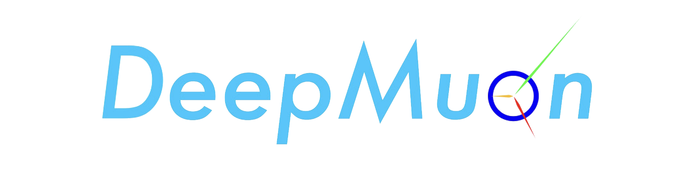

# <center></center>

## Introduction

DeepMuon is a easy-using deep learning platform built for dark matter searching experiments, we are eager to provide advanced model training frame and excellent project management assistance.

Here we list out the available features of DeepMuon:

- DeepMuon support **Single GPU** training and **Distributed Data Parallel** training
- Model Inference and analysis
- Customize models
- Customize datasets
- Customize loss functions
- Easy to train/inference
- Tidy file system
- Simple and direct tutorials

## Installation

```bash
git clone https://github.com/Airscker/DeepMuon.git
cd DeepMuon
pip install -v -e ./ --user
```

## Tutorials

- [Regulations](./Tutorial/1.Regulations.md)
- [Customize Dataset](./Tutorial/2.Customize%20Dataset.md)
- [Customize Model](./Tutorial/3.Customize%20Model.md)
- [Configuration](./Tutorial/4.Configuration.md)
- [Training and Inference](./Tutorial/5.Training%20and%20Inference.md)

## CopyRight

> GNU AFFERO GENERAL PUBLIC LICENSE
>
> Project: DeepMuon
>
> Dark Matter Searching Deep Learning Platform
>
> Author: Airscker/Yufeng Wang
>
> Contributors: Yufeng Wang, Yu Zhang, Shendong Su
>
> University of Science of Technology of China
>
> Internal supported sensor's dataset: Pandax-4T III, TRIDENT
>
> If you want to publish thesis using DeepMuon, please add bibliography:
>
> ```tex
> @article{}
> ```
> Copyright (C) 2023 by Airscker(Yufeng), All Rights Reserved.
