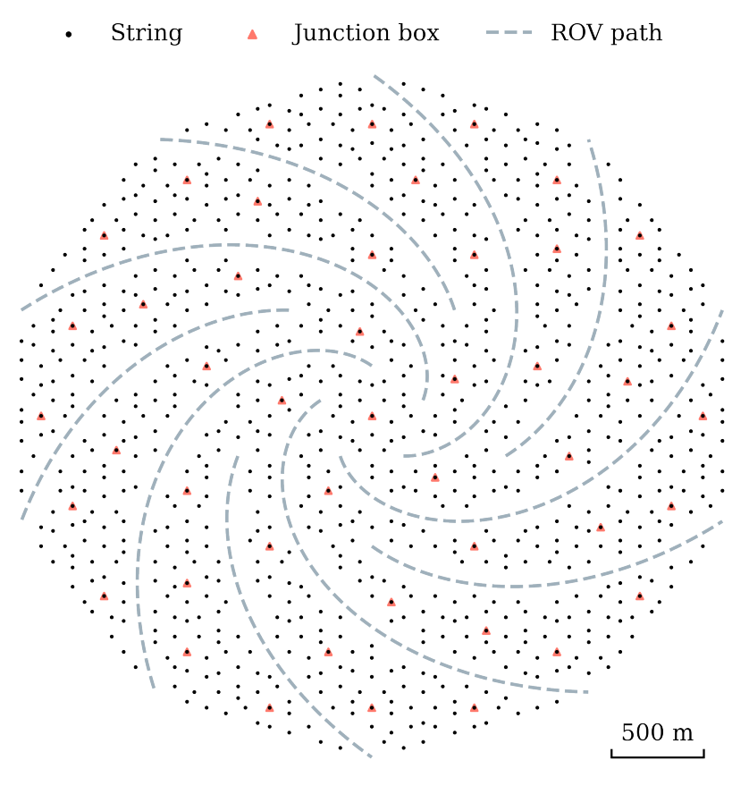
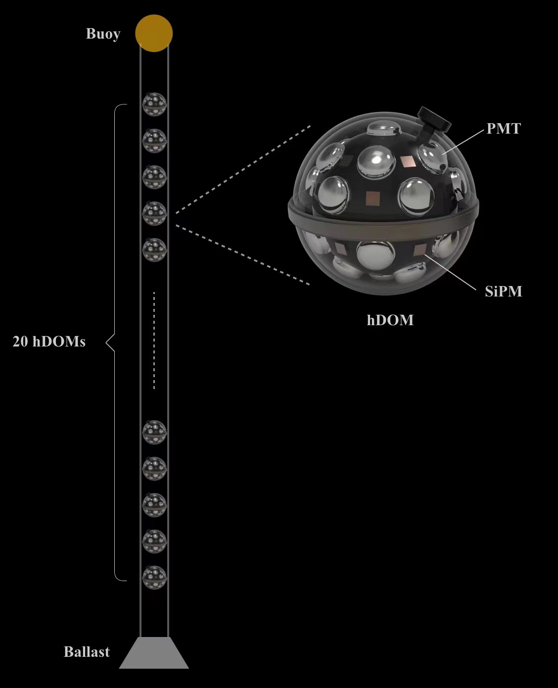
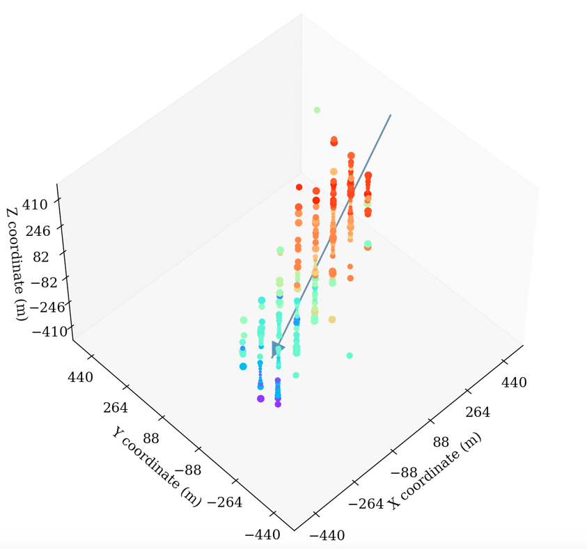
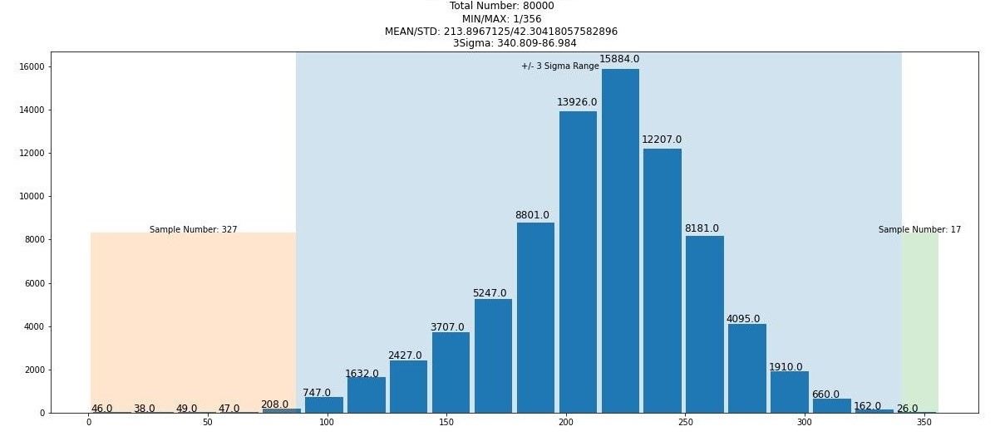

# TRIDENT Neutrino Telescope (Hailing Plan) Tracing Task

> The tRopIcal DEep-sea Neutrino Telescope, **TRIDENT** for short, is an envisioned neutrino observatory at the South China Sea, which aims to discover multiple high-energy astrophysical neutrino sources and provide a significant boost to the measurement of cosmic neutrino events of all flavors. The telescope will have an uneven configuration with more than 1,000 strings and 20,000 hybrid digital optical modules covering a volume of about 8 cubic-kilometer. The optical properties of the seawater marine environment at the selected site were characterized by the TRIDENT pathfinder experiment in September 2021. Currently, the prototype line for TRIDENT is under development.[1](#ref1)

## Introduction

Cosmic rays from deep space constantly bombard the Earth’s atmosphere, producing copious amounts of GeV - TeV neutrinos via hadronic interactions. Similar processes yielding higher energy (TeV -PeV) neutrinos are expected when cosmic rays are accelerated and interact in violent astrophysical sources, such as in jets of active galactic nuclei (AGN)[2](#ref2). Ultra-high-energy cosmic rays (UHECRs) traversing the Universe and colliding with the cosmic microwave background photons are predicted to generate ‘cosmogenic’ neutrinos (beyond EeV)[3](#ref3). Detecting astrophysical neutrino sources
will therefore be the key to deciphering the origin of the UHECRs.

However, neutrinos cannot be detected directly. These ‘ghostly’ particles are measured using extremely sensitive technologies, detecting the charged particles generated in neutrino-matter interactions. In a general detector setup, large areas of photon sensors continuously monitor a large body of target mass, e.g. pure water, liquid scintillator, liquid argon, to measure these rare and tiny energy depositions. Neutrino telescopes use large volumes of wild sea/lake water or glacial ice to observe the low rate of incident high-energy astrophysical neutrinos.[4](#ref4)

Based on the theoretical calculation and detailed design, the next-generation neutrino telescope - The tRopIcal DEep-sea Neutrino Telescope, TRIDENT for short, was built in the South China Sea, which aims to discover multiple high-energy astrophysical neutrino sources and provide a significant boost to the measurement of cosmic neutrino events of all flavors.[4](#ref4)

TRIDENT involves many basic tasks to localize and uncover the mystery of neutrinos, one of the basic steps is to uncover the tracks of neutrinos within the TRIDENT. Traditional methods include molecule dynamic simulation and linear regression. However, these methods are complex and expensive when considering computing resources and time. To enable the real-time end-to-end estimation of tracks of neutrinos, we proposed a deep-learning-based method to rebuild the tracks of neutrinos, in order to help analyze the physical principles and mysteries of cosmic rays. 

To have a complete vision of our contribution, we first introduced the basic data structure from the structure of TRIDENT to the collection of signals. Then we show the architecture of the deep-learning model used to trace the tracks. The detailed training technology and pipeline are also presented. Finally, we demonstrated the capability and interpretation of our model.

## Data Structure
### Structure of TRIDENT [1](#ref1), [4](#ref4)

    <table style="border-collapse:collapse;border-spacing:0" class="tg" frame=void rules=none>
    <thead>
        <tr>
            <th style="font-family:Arial, sans-serif;font-size:14px;font-weight:bold;overflow:hidden;padding:10px 5px;text-align:center;vertical-align:top;word-break:normal"></th>
            <th style="font-family:Arial, sans-serif;font-size:14px;font-weight:bold;overflow:hidden;padding:10px 5px;text-align:center;vertical-align:top;word-break:normal"></th>
            <th style="font-family:Arial, sans-serif;font-size:14px;font-weight:bold;overflow:hidden;padding:10px 5px;text-align:center;vertical-align:top;word-break:normal"></th>
    </thead>
    <tbody>
        <tr>
            <td style="font-family:Arial, sans-serif;font-size:14px;overflow:hidden;padding:10px 5px;text-align:center;vertical-align:top;word-break:normal">(a)</td>
            <td style="font-family:Arial, sans-serif;font-size:14px;overflow:hidden;padding:10px 5px;text-align:center;vertical-align:top;word-break:normal">(b)</td>
            <td style="font-family:Arial, sans-serif;font-size:14px;overflow:hidden;padding:10px 5px;text-align:center;vertical-align:top;word-break:normal">(c)</td>
        </tr>
    </tbody>
</table>

<b>(a). Geometry layout of the TRIDENT array.</b> The pattern follows a Penrose tiling distribution. Each black dot represents a string of length of ∼ 0.7 km, while the dashed lines mark the paths for underwater maintenance robots. <b>(b). Single string of TRIDENT.</b> The preliminary layout of the envisioned telescope follows a Penrose tiling distribution with twofold inter-string distances, 70 m and 110 m. The full detector is composed of 1211 strings, each containing 20 hDOMs separated vertically by 30 m. <b>(c). Hybrid Digital Optical Module (hDOM).</b> TRIDENT will employ a hybrid digital optical module (hDOM) with both PMTs and SiPMs. One the one hand, SiPMs can respond to photon hit within tens of picoseconds. On the other, the TDCs are capable of digitizing the sharp raising edge of a SiPM. Besides, the White Rabbit system can provide precise global time stamps. With the help of these state-of-the-art technologies, the arrival time of Cherenkov photons will be more precisely measured. Applying hDOM in the telescope will achieve ~40% improvement in angular resolution in comparison to traditional PMT only DOM, which would significantly boost the source searching capability.

### Collected Dataset

As shown above, the physical structure of TRIDENT determines the data structure we collected from TRIDENT. By converting signals accepted by hDOMs into orthogonal coordinates, we can feed data into common deep-learning models to infer the incident angle of neutrinos. The converted data sample is shown as this:

    
    

        <b>Converted data structure.</b> The strength of signal points is represented as the color of signal points, and the vector indicates the direction of the incident neutrino.
    

    

However, the real data we got contained three types of information at every signal point: 

- Hit number
- Mean arriving time
- Standard deviation of arrival time

What's more, not every non-zero (at least contained one kind of information) point has three types of information, and each data sample's available signal points are different from another:

    <b>Distribution of the number of available Signal points of every data sample(NAS).</b>
    The maximal number of available signal points within a data sample if 356 and the minimal number is only 1. And the mean value of NAS is 214, the standard derivation is 42. Suppose the distribution obeys normal distribution then its 3-Sigma range is 340 ~ 87.
    

To avoid the possible negative effects brought by out-of-physical data samples, we need to abandon points without three kinds of information and abandon samples whose NAS is lower than $\mu-3\sigma=87$.

## Experiment

### ResMax3

### Basic Configuration
- Loss Function
- 

### Training Pipeline

### Interpretation - Integrated Gradient

[1]: https://trident.sjtu.edu.cn/en

[2]: K.Murase, F. W. Stecker, <b>High-Energy Neutrinos from Active Galactic Nuclei.</b> arXv:2202.03381.

[3]: K. Kotera, D. Allard, A. Olinto, <b>Cosmogenic neutrinos: parameter space and detectabilty from PeV to ZeV</b>, Journal of Cosmology and Astroparticle Physics 2010 (10) (2010) 013-013. doi:10.1088/1475-7516/2010/10/013.

[4]: Z. P. Ye, F. Hu, W. Tian, Q. C. Chang, Y. L. Chang, Z. S. Cheng, J. Gao, T. Ge, G. H. Gong, J. Guo, X. X. Guo, X. G. He, J. T. Huang, K. Jiang, P. K. Jiang, Y. P. Jing, H. L. Li, J. L. Li, L. Li, W. L. Li, Z. Li, N. Y. Liao, Q. Lin, F. Liu, J. L. Liu, X. H. Liu, P. Miao, C. Mo, I. Morton-Blake, T. Peng, Z. Y. Sun, J. N. Tang, Z. B. Tang, C. H. Tao, X. L. Tian, M. X. Wang, Y. Wang, Y. Wang, H. D. Wei, Z. Y. Wei, W. H. Wu, S. S. Xian, D. Xiang, D. L. Xu, Q. Xue, J. H. Yang, J. M. Yang, W. B. Yu, C. Zeng, F. Y. D. Zhang, T. Zhang, X. T. Zhang, Y. Y. Zhang, W. Zhi, Y. S. Zhong, M. Zhou, X. H. Zhu, G. J. Zhuang, <b>Proposal for a neutrino telescope in South China Sea.</b>arXiv:2207.04519
